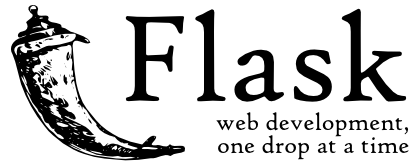

:orphan:

Doc Flask PT_BR
================

Bem-vindo a documentação do Flask. Esta documentação é dividida em
diferentes partes. Eu recomendo que você começar a trabalhar com
:ref:`instalação` e, em seguida, dirigir-se a :ref:`quickstart`.
Além do início rápido, há também uma forma mais detalhada: ref: `tutorial que`
mostra como criar uma aplicação completa (embora pequena) com Flask. se
você prefere mergulhar os internos do balão, confira
a :ref:`api` documentação. Padrões comuns são descritos na :ref:`patterns` padrões.

Flask depende de duas bibliotecas externas: o `Jinja2`_ modelo
motor e o `Werkzeug`_ WSGI toolkit. Essas bibliotecas não são documentados
aqui. Se você quiser mergulhar em sua documentação, confira o seguintes links:

-   `Jinja2 Documentation <http://jinja.pocoo.org/2/documentation/>`_
-   `Werkzeug Documentation <http://werkzeug.pocoo.org/documentation/>`_

.. _Jinja2: http://jinja.pocoo.org/2/
.. _Werkzeug: http://werkzeug.pocoo.org/

.. include:: contents.rst.inc
